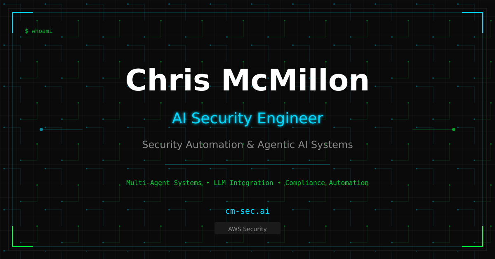
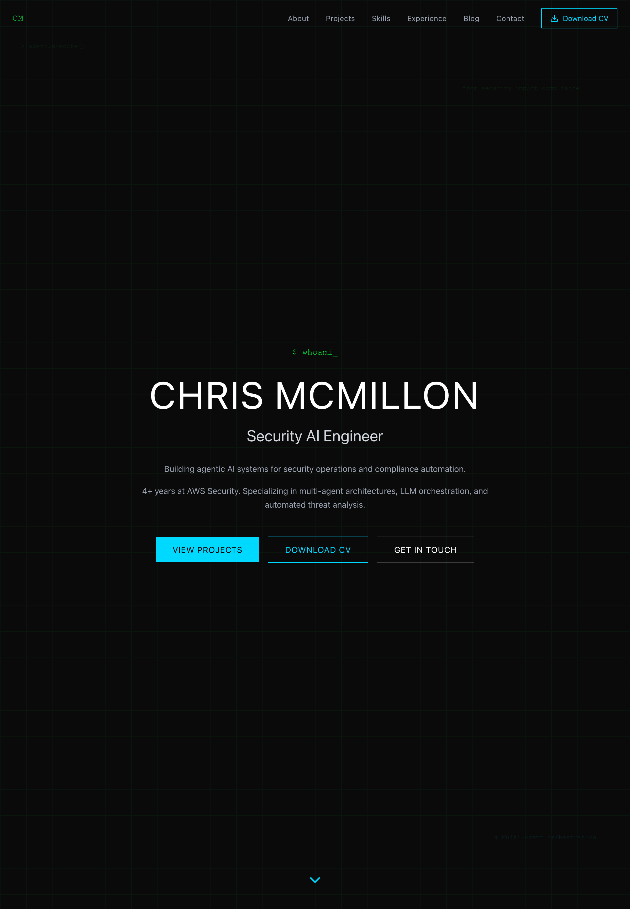

<a href="https://cm-sec.ai">
  
</a>

<p align="center">
  <a href="https://cm-sec.ai"><strong>cm-sec.ai</strong></a>
</p>

---

A modern portfolio site built with React, TypeScript, and Tailwind CSS — deployed on AWS Amplify.

<p align="center">
  
  
  
  
  
</p>

<p align="center">
  
</p>

## Quick Start

```bash
bun install
bun run dev
```

The dev server starts at `http://localhost:3000` with hot reload.

## Available Scripts

| Command | Description |
|---------|-------------|
| `bun run dev` | Start development server |
| `bun run build` | Production build to `dist/` |
| `bun run preview` | Preview production build locally |
| `bun run lint` | Run ESLint on `src/` |
| `npx vitest run` | Run unit tests (one-shot) |
| `bun run test` | Run unit tests (watch mode) |
| `npm run test:e2e` | Run Playwright end-to-end tests |
| `npm run test:e2e:update` | Update Playwright visual snapshots |
| `bun run sync-locks` | Regenerate `package-lock.json` from `bun.lock` |

## Project Structure

```
cm-labs/
├── src/
│   ├── components/        # React components
│   │   └── ui/            # Reusable UI primitives (Radix-based)
│   ├── data/              # Data modules (projects, diagrams, acronyms)
│   ├── styles/            # Global styles
│   ├── App.tsx            # Main application component
│   └── main.tsx           # Entry point
├── tests/
│   ├── components/        # Unit tests (Vitest + RTL)
│   └── e2e/               # End-to-end tests (Playwright)
├── infrastructure/        # AWS CDK deployment stack
├── scripts/               # Build & utility scripts
├── .github/workflows/     # CI, security scanning, deployment
├── public/                # Static assets
└── docs/                  # Documentation & plans
```

## Testing

Unit tests use **Vitest** with React Testing Library. End-to-end and visual regression tests use **Playwright**.

```bash
npx vitest run          # Unit tests
npm run test:e2e        # E2E tests
```

## Deployment

Deployed via **AWS Amplify** with CDK infrastructure. See [`infrastructure/README.md`](infrastructure/README.md) for details.

## Contributing

Suggestions and feedback are welcome — feel free to open an issue.

## License

MIT

## Links

- **Live Site**: [cm-sec.ai](https://cm-sec.ai)
- **GitHub**: [github.com/Stealinglight/cm-labs](https://github.com/Stealinglight/cm-labs)
