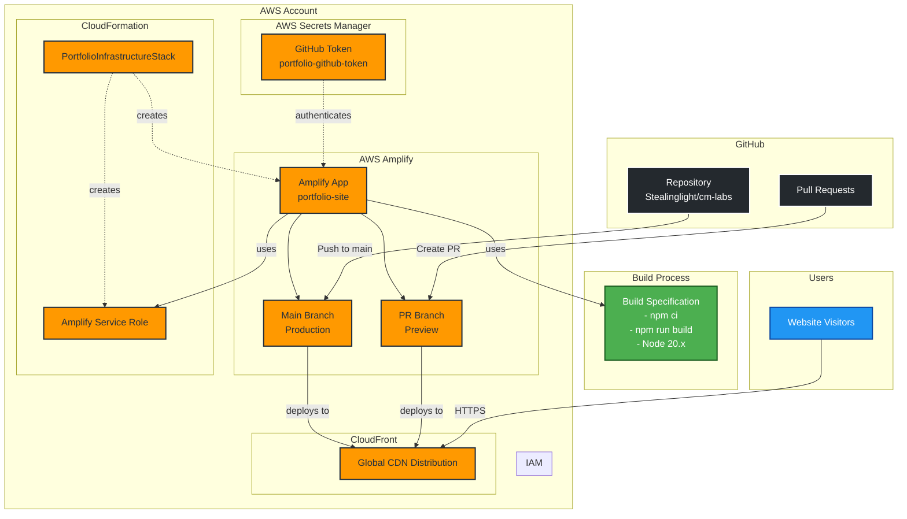
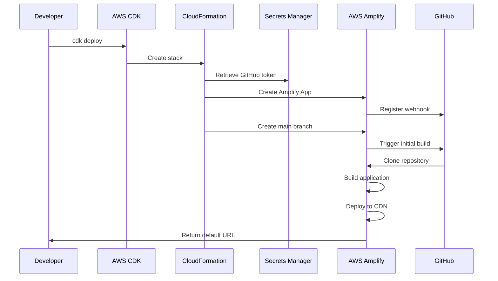
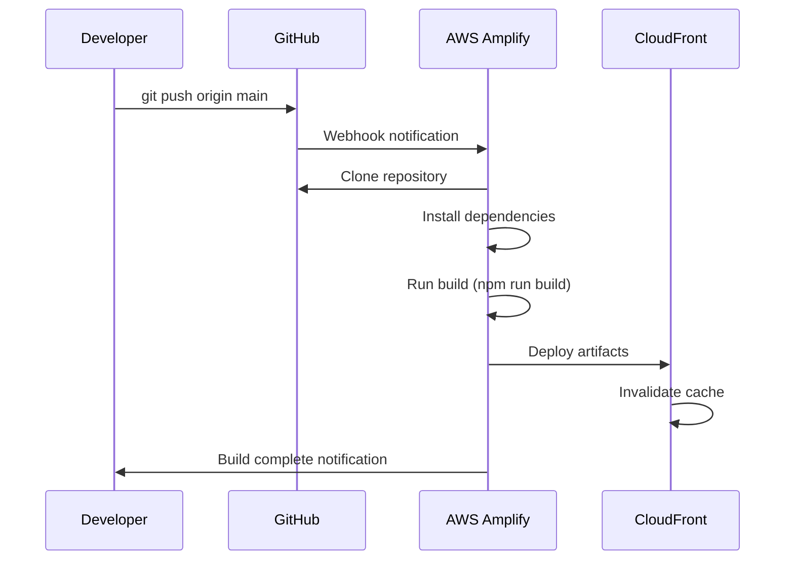
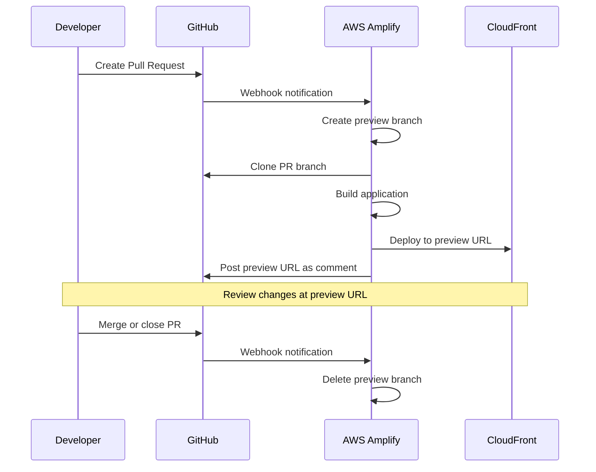

# Infrastructure Architecture

This document describes the architecture of the portfolio website deployment infrastructure.

## Overview

The infrastructure uses AWS Amplify Hosting connected to GitHub for continuous deployment of the React portfolio website. All resources are provisioned using AWS CDK.

## Architecture Diagram

## Component Details

### GitHub Integration

**Repository**: `Stealinglight/cm-labs`
- Source code for the React portfolio website
- Monitored for changes on main branch
- Pull requests trigger preview deployments

**Authentication**: GitHub Personal Access Token
- Stored securely in AWS Secrets Manager
- Requires `repo` scope for repository access
- Used by Amplify to clone repository and register webhooks

### AWS Amplify

**Amplify App** (`portfolio-site`)
- Hosts the static website
- Manages build and deployment process
- Provides automatic SSL certificates
- Serves content via CloudFront CDN

**Main Branch** (Production)
- Connected to `main` branch in GitHub
- Auto-build enabled (builds on every push)
- Production stage designation
- Custom domain support (optional)

**PR Branches** (Preview Environments)
- Automatically created for pull requests
- Isolated preview URLs for each PR
- Automatically deleted when PR is closed

### Build Configuration

**Build Process**:
1. Clone repository
2. Install dependencies (`npm ci`)
3. Build application (`npm run build`)
4. Deploy to CDN

**Environment**:
- Node.js 20.x runtime
- Build caching enabled for `node_modules/`
- Build output directory: `build/`

**Single-Page Application Support**:
- Custom rewrite rule: `/<*>` → `/index.html` (404-200)
- Enables client-side routing without 404 errors

### AWS Services

**CloudFormation**:
- Infrastructure as Code stack
- Manages all Amplify resources
- Provides outputs for URLs and IDs

**IAM**:
- Service role for Amplify
- Permissions to access CloudWatch Logs
- Managed by CloudFormation

**Secrets Manager**:
- Stores GitHub OAuth token
- Retrieved securely during stack creation
- Token never exposed in code or CloudFormation templates

**CloudFront CDN**:
- Global content delivery network
- Automatic SSL/TLS encryption
- Edge caching for improved performance
- Managed automatically by Amplify

## Deployment Flow

### Initial Deployment

### Continuous Deployment (Push to Main)

### Pull Request Preview

## Security Considerations

### Authentication & Authorization

- GitHub token stored in AWS Secrets Manager (encrypted at rest)
- IAM role with minimal required permissions
- No hardcoded credentials in code or configuration

### Network Security

- All traffic encrypted with TLS/SSL
- Certificates automatically provisioned and renewed
- CloudFront provides DDoS protection

### Build Security

- Dependencies locked in `package-lock.json`
- Build process isolated per branch
- No access to production resources during build

## Scaling & Performance

### Automatic Scaling

- CloudFront automatically scales to handle traffic
- No manual capacity planning required
- Global edge locations for low latency

### Build Performance

- Node modules cached between builds
- Incremental builds when possible
- Parallel PR preview builds

## Monitoring & Logging

### Available Metrics

- Build success/failure rates
- Build duration
- Deployment frequency
- Traffic metrics via CloudFront

### Logs

- Build logs available in Amplify Console
- CloudFront access logs (optional)
- CloudFormation stack events

## Cost Considerations

### Primary Cost Factors

1. **Amplify Build Minutes**: Free tier includes 1000 minutes/month
2. **Amplify Hosting**: Free tier includes 15GB storage + 15GB data transfer
3. **CloudFront**: Pay for data transfer out
4. **Secrets Manager**: $0.40/secret/month

### Cost Optimization

- Enable build caching to reduce build time
- Use CloudFront caching to minimize data transfer
- Delete unused PR preview environments automatically

## Disaster Recovery

### Backup Strategy

- Infrastructure code in Git (this repository)
- Application code in GitHub
- All resources reproducible via `cdk deploy`

### Recovery Procedure

1. Ensure GitHub repository is accessible
2. Run `cdk deploy` to recreate infrastructure
3. Amplify automatically rebuilds from GitHub

### Recovery Time Objective (RTO)

- Infrastructure recreation: ~5-10 minutes
- Initial build and deployment: ~5-10 minutes
- **Total RTO: ~15-20 minutes**

## Future Enhancements

### Potential Improvements

1. **Custom Domain**: Configure custom domain with Route 53
2. **Multi-Environment**: Add staging environment
3. **Monitoring**: Add CloudWatch alarms for build failures
4. **Notifications**: SNS notifications for deployment events
5. **Analytics**: Integrate AWS CloudWatch RUM for user analytics
6. **Performance**: Add CloudFront functions for edge optimization

### Migration Path

When Amplify L2 constructs graduate from alpha:
- Update to stable constructs from `aws-cdk-lib`
- Remove alpha package dependency
- Test and redeploy

## References

- [AWS Amplify Hosting Documentation](https://docs.aws.amazon.com/amplify/latest/userguide/welcome.html)
- [AWS CDK Documentation](https://docs.aws.amazon.com/cdk/)
- [CloudFront Documentation](https://docs.aws.amazon.com/cloudfront/)
- [Infrastructure Code](./lib/portfolio-stack.ts)
